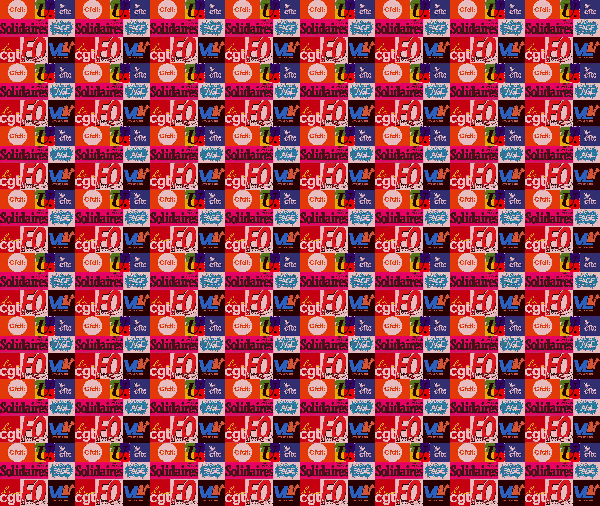
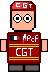
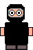
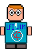

# My_RPG (en)
## A year 1 Epitech Project
### Mar-Apr. 2023

 

### Spoiler : Contains politics <ins>only for fun</ins>
#### Display languages is only French

    
    
    
    
    
    
    
    

 

My_RPG is an Epitech Project which consists in creating a RPG in game almost from scratch.

Only CSFML library (C binding for C++ SFML) and some C functions, and we must be compliant with the [Epitech Coding Style](Epitech%20C%20Coding%20Style.pdf).

Check the [subject](Subject%20MyRPG.pdf) for more information.

 

This repository is a duplicate of my private Epitech repository, so that I can continue to improve this project.

To see what was done at the project deadline, see commit [3af943eca109e4d1c7d1fd8a6f53eaed2ed8b6fe](https://github.com/Chi-Iroh/my_rpg/tree/3af943eca109e4d1c7d1fd8a6f53eaed2ed8b6fe).

 

#### Controls
ZQSD - up, left, bottom, right
Space or left click - attack
Mouse wheel up / down - next / previous weapon
Escape - pause menu (in game) / exit game (title screen)

##### Warning : Slow tutorial
The tutorial is very slow but functional, just hold down S to go to the bottom, it only take a few seconds.

 

Huge thanks to my 3 mates who have done an incredible work !
- Nils Perriolat (Graphic Part - Interfacing with CSFML)
- Mathieu Coulet (Crowd - Hitbox)
- Adrien Audiard (UI - Boss)

And I:
- Thomas Sayen (Sprites - Sounds - Character Selection - Lose animations)

All credits for cop sprites go to [Streets of Rogue](https://store.steampowered.com/app/512900/Streets_of_Rogue/) creators.

BGM:
- [Menu - Happy Bee](https://www.youtube.com/watch?v=oYRNag5NJM4)
- [Protest - 49.3](https://www.youtube.com/watch?v=0P5oFFBMaNw)
- [Boss (unused) - Bonetrousle](https://www.youtube.com/watch?v=AKAiUtWZ4xY)

SFX:
- [Statistics - Nyah](https://pixabay.com/sound-effects/nyah-105109/)
- [Lose - 49.3 Élisabeth Borne](https://www.youtube.com/watch?v=e1Kxkg3Lvwk)
- [Load / Save Fail - Windows XP Error](https://www.youtube.com/watch?v=0lhhrUuw2N8)
- [Load / Save Success / SFX Volume Settings - Discord Notification](https://www.youtube.com/watch?v=rIPq9Fl5r44)
- [Level Up - Mario Bros Mushroom](https://www.youtube.com/watch?v=6G-k4zxou7Y)
- [UI Buttons - Explosion](https://www.youtube.com/watch?v=4Ifc9D_fyrY)
- [Unused - Macron Explosion](https://www.youtube.com/watch?v=BO-pNmfojao)

 

# My_RPG (fr)
## Un projet de première année d'Epitech
### Mar-Avr. 2023

 

### Spoiler : Contenu politique <ins>à but d'amusement uniquement</ins>

    
    
    
    
    
    
    
    

 

My_RPG est un projet d'Epitech qui consiste à développer un RPG à partir de presque rien.

Seule la bibliothèque CSFML (le binding C de la SFML de C++) et quelques fonctions standards du C, tout en respectant de [Coding Style Epitech](Epitech%20C20Coding%20Style.pdf).

Regardez le [sujet](Subject%20MyRPG.pdf) pour plus d'informations.

 

Ce dépôt est une copie de mon dépôt privé Epitech, pour pouvoir continuer à l'améliorer.

Pour voir ce qui a été rendu, regardez le commit [3af943eca109e4d1c7d1fd8a6f53eaed2ed8b6fe](https://github.com/Chi-Iroh/my_rpg/tree/3af943eca109e4d1c7d1fd8a6f53eaed2ed8b6fe).

 

#### Contrôles
ZQSD - haut, gauche, bas, droite
Espace ou clic gauche - attaque
Molette de souris haut / bas -  arme suivante / précédente
Échap - menu pause (en jeu) / arrêter le jeu (écran titre)

##### Avertissement : Tutoriel lent
Le tutoriel est lent mais fonctionnel, maintenez simplement S pour aller vers le bas, cela prend juste quelques secondes.

 

Un gros merci à mes 3 camarades qui ont fait un travail incroyable !
- Nils Perriolat (Partie Graphique - Interface avec la CSFML)
- Mathieu Coulet (Foule - Collisions)
- Adrien Audiard (Interface - Boss)

Et moi:
- Thomas Sayen (Personnages - Sons - Sélection des Personnages - Animation de Défaite)

Le design des policiers appartient aux créateurs de [Streets of Rogue](https://store.steampowered.com/app/512900/Streets_of_Rogue/).

BGM:
- [Menu - Happy Bee](https://www.youtube.com/watch?v=oYRNag5NJM4)
- [Manifestation - 49.3](https://www.youtube.com/watch?v=0P5oFFBMaNw)
- [Boss (inutilisé) - Bonetrousle](https://www.youtube.com/watch?v=AKAiUtWZ4xY)

SFX:
- [Statistiques - Nyah](https://pixabay.com/sound-effects/nyah-105109/)
- [Perte - 49.3 Élisabeth Borne](https://www.youtube.com/watch?v=e1Kxkg3Lvwk)
- [Erreur de Chargement / Sauvegarde - Erreur Windows XP](https://www.youtube.com/watch?v=0lhhrUuw2N8)
- [Chargement / Sauvegarde / Paramètres de volume des SFX - Notification Discord](https://www.youtube.com/watch?v=rIPq9Fl5r44)
- [Niveau Supérieur - Champignon Mario Bros](https://www.youtube.com/watch?v=6G-k4zxou7Y)
- [Boutons Interface - Explosion](https://www.youtube.com/watch?v=4Ifc9D_fyrY)
- [Inutilisé - Macron Explosion](https://www.youtube.com/watch?v=BO-pNmfojao)
