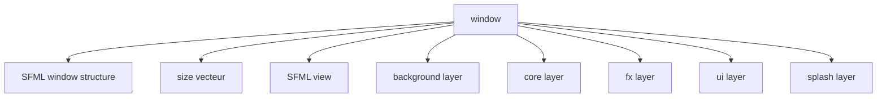
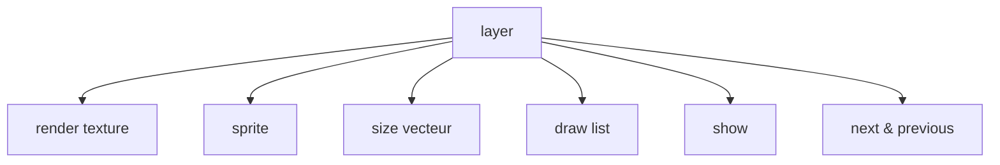
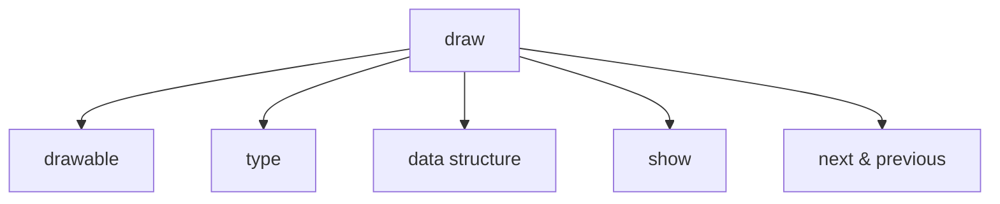
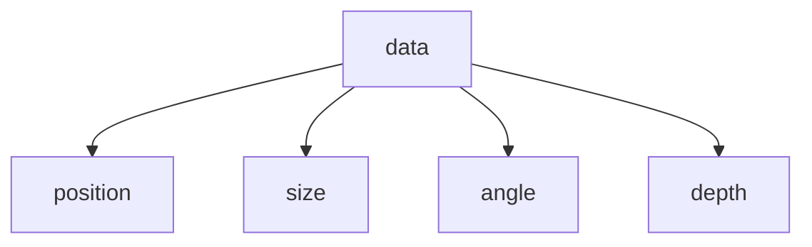
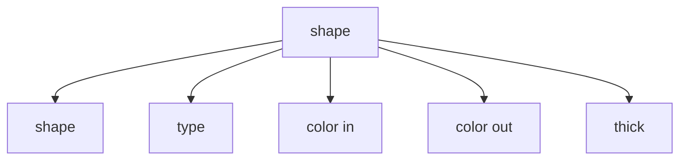
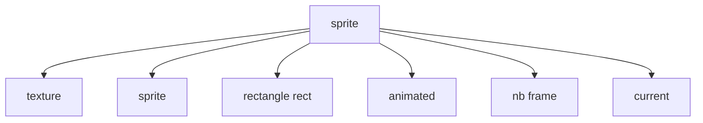
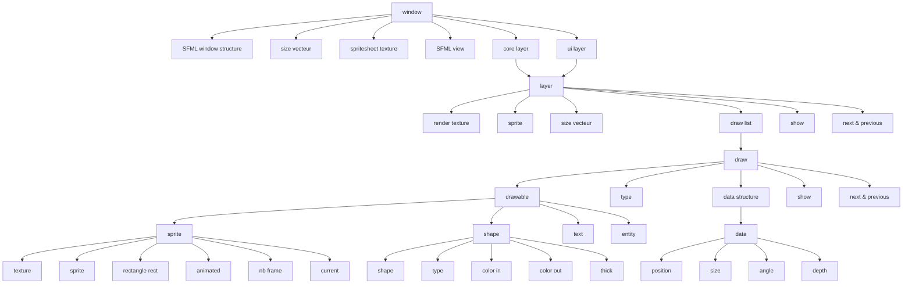

# Library My Graphics 0.1
La librairie My Graphics est une sur-couche à la CSFML. Elle permet de limiter l'usage par l'utilisateur de fonctions graphiques de la sfml pour manipuler des objets tel que des sprites. La librairie fournie aussi une fenêtre avec un agencement plus complexe pour simplifier la création d'un jeu avec la sfml.

# How to Use
## Window
Premièrement, comme pour la SFML, il faut créer la fenêtre principale.
### What is it
Dans la lib window_t correspond à une structure qui contient entre autre la fenêtre de la SFML. Voici un schéma pour la représenter :

- **size** est un vecteur à deux dimension qui conserve les dimensions initiales de la window.
- **window** est un pointeur vers la structure sfRenderWindow correspondant à la structure window.
- **view** est globalement une caméra interactive qui permet de modifier le point de vue de la window.
- **background** est une structure layer (voir section correspondante) destinée à contenir tous les assets de fond du jeu sans interactivités.
- **core** est une structure layer (voir section correspondante) destinée à contenir tous les assets manipulables du jeu en lui-même.
- **fx** est une structure layer (voir section correspondante) destinée à contenir tous les effets spéciaux.
- **ui** est une structure layer (voir section correspondante) destinée à contenir les assets de l'interface utilisateur. Ce layer n'est pas affecté par la view.
- **splash** est une structure layer (voir section correspondante) destinée à contenir le splash screen.

### Creation
Pour créer notre fenêtre il suffit de créer une window_t structure en utilisant la fonction suivante :
```c
window_t * create_window(const char * title, const sfVideoMode mode, const char * file);
```
- **title** correspond au titre de la fenêtre.
- **mode** est une structure de la SFML qui contient la largeur, la hauteur et le framerate de la fenêtre.
- **file** est un path vers une image qui peut servir d'icone. Si vous ne voulez pas en fournir, remplacez par NULL.

### Displaying
Pour l'affichage il suffit d'appeler la fonction suivante lors du rafraîchissement de l'image :
```c
void actualize_window(window_t * window);
```
Il suffit de lui donner la window en paramètre et tout sera calculé et affiché par la fonction.
Si toutefois vous souhaitez manipuler vous même les étapes d'affichages vous pouvez utiliser les fonctions d'affichages des sous-structures de la lib.
En revanche l'usage des deux méthodes est incompatible, attention.

### Destruction
Toujours penser à free. En l'occurence il suffit d'appeler la fonction suivante pour free la fenêtre et tout ce qui aura été créé par la lib par la suite (si et seulement si tout est correctement créé) :
```c
void free_window(window_t * window);
```
Bien que cela est possible, il est fortement déconseillé d'appeler les autres fonctions de free de la lib ou de la SFML.

### Manipulate the view
Pour manipuler la caméra on peut utiliser les fonctions suivantes.
```c
void view_resize(window_t * window, sfVector2f size);
void view_center(window_t * window, sfVector2f center);
void view_set_rotation(window_t * window, float angle);
void view_rotate(window_t * window, float angle);
void view_zoom(window_t * window, float factor);
```
La caméra se manipule globalement comme un sprite donc je ne vais pas tout réexpliquer sauf pour view_center. La view, contrairement à un sprite, se manipule grâce à son centre. Il faudra donc penser à donner le centre du sprite et non la position en haut à gauche du sprite.

## Layer
Une fois la window créée, les différents assets à afficher sont répartis sur des layers différents. Par défaut il y en à 5 dans la window cependant on peut en ajouter plus en les chaînants.
### What is it
Un layer agit comme une sorte de fenêtre dans la fenêtre. Donc on peut y appliquer à peu près tout ce que l'on peut faire à la fenêtre d'un point de vue graphique. Cela permet de aisémenet l'affichage de sprites à des profondeurs différentes et les modifications de masse sur plusieurs sprites.

- texture est une sfRenderTexture. C'est une texture de la SFML qui agit comme une sfRenderWindow.
- sprite permet juste d'afficher la texture du layer sur la fenêtre au moment de l'affichage.
- size est un vecteur qui correspond aux dimensions de la texture.
- draw est une liste de draw structure (voir section correspondante) qui sont tous les assets qui peuvent être affiché dans ce layer.
- show est un bouléen qui indique si le layer doit être affiché sur la window lors du rafraîchissement de l'image.
- next & previous sont des pointeurs vers les autres layers si existants.
### Creation
Vous n'aurez pas à gérer vous même la création de layer. En cas de besoin, voir dans le header *layer.h* la fonction *create_layer*.
### Displaying
Vous n'aurez pas à gérer vous même l'affichage de layer. En cas de besoin, voir dans le header *layer.h* la fonction *draw_layers*.
### Destruction
Vous n'aurez pas à gérer vous même le free de layer. En cas de besoin, voir dans le header *layer.h* la fonction *free_layers*.
## Draw
Une draw structure est un asset à afficher sur un layer. Cet asset peut être un sprite, un rectangle, un cercle, du texte ou une entité complexe (voir les sections correspondantes pour plus d'informations ; PS: pour rectangle et cercle voir shape).
### What is it
Voici un schéma qui représente la draw structure :

- drawable est un pointeur vers une structure affichable dans un layer
- type est une valeur représentant la structure drawable. Voir l'énumération *draw_type_t* dans *draw.h*.
- data est un pointeur vers une data structure.
- show est un bouléen qui indique si l'asset doit être affiché sur le layer lors du rafraîchissement de l'image.
- next & previous sont des pointeurs vers les autres assets.
### Creation
Pour créer un draw il faut utiliser la fonction suivante :
```c
draw_t * create_draw(void * drawable, draw_type_t type, data_t * data, void * previous);
```
- drawable est un pointeur vers une structure préinitialisée.
- type est une valeur qui représente la structure drawable.
- data est un pointeur vers une data structure préinitialisée.
- previous est l'adresse du draw précédent. Donner NULL s'il n'y a pas de précédent.
### Displaying
Vous n'aurez pas à gérer vous même l'affichage de draw. En cas de besoin, voir dans le header *draw.h* la fonction *draw_draws*.
### Destruction
Vous n'aurez pas à gérer vous même le free de draw. En cas de besoin, voir dans le header *draw.h* la fonction *free_draws*.
## Data
La structure data est une structure de donnée manipulable pour intéragir avec une draw structure sans manipuler le draw lui-même.
### What is it
Voici un schéma des données stockées dans la structure :

- position est un vecteur à trois dimensions qui représente la position dans l'espace.
- size est un vecteur à deux dimensions qui représente la taille du draw.
- angle est un nombre qui représente la rotation du draw.
- depth est un score calculé à partir de la position pour déterminer à quelle profondeur se trouve le draw par rapport aux autres.
### Creation
Pour créer une data structure il faut utiliser la fonction suivante :
```c
data_t * create_data(sfVector3f position, sfVector2f size, float angle);
```
- position est un vecteur à trois dimensions.
- size est un vecteur à deux dimensions.
- angle est un nombre décimal.
### Destruction
Vous n'aurez pas à gérer vous même le free de data. En cas de besoin, voir dans le header *data.h* la fonction *free_data*.
## Shape
Une shape est une structure qui représente une forme rectangulaire ou circulaire.
### What is it
Voici les éléments qui compose une shape structure (ne pas oublier qu'une partie de l'information est stocké dans la structure draw parent) :

- shape est un pointeur vers la SFML structure correspondante entre sfCircle et sfRectangle.
- type est une valeur qui représente si la shape est un rectangle ou un cercle (voir énumération *shape_type_t* dans *shape.h*).
- color_in est la couleur qui remplira l'intérieur de la forme.
- color_out est la couleur qui remplira le contour de la forme.
- thick est un nombre qui représente l'épaisseur du contour de la forme.
### Creation
Une shape est créée avec la fonction suivante :
```c
shape_t * create_shape(shape_type_t type, sfColor color_in, sfColor color_out, int thick);
```
- type spécifie si c'est un rectangle ou un cercle.
- color_in & color_out sont des sfColor qui composeront la shape.
- thick détermine l'épaisseur du contour de la shape.
### Displaying
Vous n'aurez pas à gérer vous même l'affichage de shape. En cas de besoin, voir dans le header *shape.h* la fonction *draw_shape*.
### Destruction
Vous n'aurez pas à gérer vous même le free de shape. En cas de besoin, voir dans le header *shape.h* la fonction *free_shape*.
## Sprite
Un sprite est une structure qui permet de manipuler une image. Cette image peut être animée à l'aide d'une spritesheet.
### What is it
Voici un schéma qui représente l'architecture d'une structure sprite :

- texture est une SFML structure qui représente l'image qui sera manipulée.
- sprite est une SFML structure qui permet d'afficher et manipuler la texture.
- rect est un rectangle qui représente quelle zone de la texture sera prise en compte (notamment pour l'utilisation de spritesheet).
- animated est un bouléen qui indique si le sprite est animé ou non.
- nb_frame est un nombre qui indique le nombre d'images qui composent l'animation du sprite.
- current est un nombre qui indique à quelle étape de l'animation le sprite se trouve.
### Creation
Un sprite se crée en plusieurs étapes. En premier il faut l'initialiser vierge avec la fonction suivante :
```c
sprite_t * init_sprite(void);
```
Ensuite il faut lier le sprite avec une data structure préinitialisée avec la fonction suivante :
```c
void set_data_sprite(sprite_t * sprite, data_t * data);
```
Ensuite il faut lier le sprite avec une texture préinitialisée avec la fonction suivante :
```c
void set_texture_sprite(sprite_t * sprite, sfTexture * texture, sfIntRect rect);
```
Si le sprite est animé, on active l'animation avec la fonction suivante :
```c
void set_animation_sprite(sprite_t * sprite, int nb_frame);
```
**Attention :** pour que l'animation puisse être automatisé, il faut que les différentes frames de l'animation se suivent sur la spritesheet sur la même ligne horizontale sans espace entre les frames. Il faut aussi que chaque frame ai les mêmes dimensions.
### Displaying
Vous n'aurez pas à gérer vous même l'affichage de sprite. En cas de besoin, voir dans le header *sprite.h* la fonction *draw_sprite*.
### Destruction
Vous n'aurez pas à gérer vous même le free de sprite. En cas de besoin, voir dans le header *sprite.h* la fonction *free_sprite*.
## Entity
Pas encore implémenté.
## Text
Pas encore implémenté.
## Vector & Rectangle functions
Pour initialiser des vecteur vous pouvez utiliser les fonctions suivantes :
```c
sfVector2f set_2vector(float x, float y);
sfVector3f set_3vector(float x, float y, float z);
```
Pour plus de fonctions de manipulation de vecteur se référer à *vector.h*.
Pour initialiser un rectangle vous pouvez utiliser la fonction suivante :
```c
sfIntRect set_rectangle(int left, int top, int width, int height);
```
# Global Architecture
Voici un schéma qui résume l'architecture globale de la lib :

