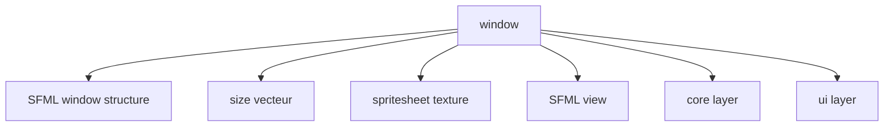
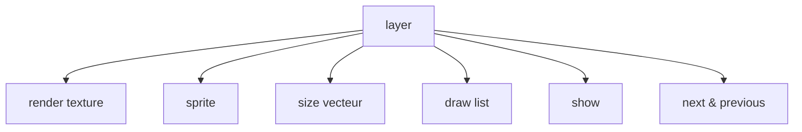
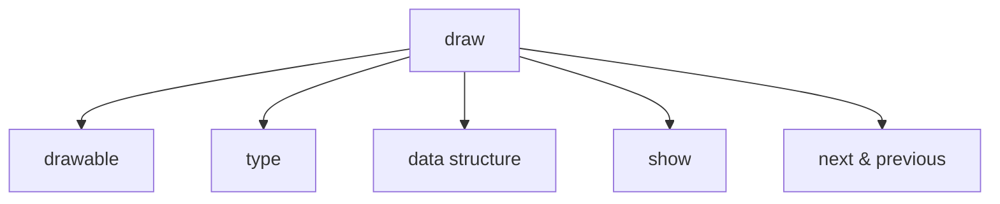

# Library My Graphics 0.1
La librairie My Graphics est une sur-couche à la CSFML. Elle permet de limiter l'usage par l'utilisateur de fonctions graphiques de la sfml pour manipuler des objets tel que des sprites. La librairie fournie aussi une fenêtre avec un agencement plus complexe pour simplifier la création d'un jeu avec la sfml.

# How to Use
## Window
Premièrement, comme pour la SFML, il faut créer la fenêtre principale.
### What is it
Dans la lib window_t correspond à une structure qui contient entre autre la fenêtre de la SFML. Voici un schéma pour la représenter :

- size est un vecteur à deux dimension qui conserve les dimensions initiales de la window.
- window est un pointeur vers la structure sfRenderWindow correspondant à la structure window.
- view est globalement une caméra interactive qui permet de modifier le point de vue de la window.
- spritesheet est une texture de spritesheet réutilisable pour l'animation des sprites.
- core est une structure layer (voir section correspondante) destinée à contenir tous les assets du jeu en lui-même.
- ui est une structure layer (voir section correspondante) destinée à contenir les assets de l'interface utilisateur. Ce layer n'est pas affecté par la view.

### Creation
Pour créer notre fenêtre il suffit de créer une window_t structure en utilisant la fonction suivante :
```c
window_t * create_window(const char * title, const sfVideoMode mode, const char * file, const char * spritesheet);
```
- title correspond au titre de la fenêtre.
- mode est une structure de la SFML qui contient la largeur, la hauteur et le framerate de la fenêtre.
- file est un path vers une image qui peut servir d'icone. Si vous ne voulez pas en fournir, remplacez par NULL.
- spritesheet est un path vers une simage qui peut servir de spritesheet pour tous sprites manipulés par la suite. Si vous ne voulez pas en fournir, remplacez par NULL.
### Displaying
Pour l'affichage il suffit d'appeler la fonction suivante lors du rafraîchissement de l'image :
```c
void actualize_window(window_t * window);
```
Il suffit de lui donner la window en paramètre et tout sera calculé et affiché par la fonction.
Bien que cela est possible, il est fortement déconseillé d'appeler les autres fonctions d'affichage de la lib ou de la SFML.
### Destruction
Toujours penser à free. En l'occurence il suffit d'appeler la fonction suivante pour free la fenêtre et tout ce qui aura été créé par la lib par la suite (si et seulement si tout est correctement créé) :
```c
void free_window(window_t * window);
```
Bien que cela est possible, il est fortement déconseillé d'appeler les autres fonctions de free de la lib ou de la SFML.
### Manipulate the view
Pour manipuler la caméra on peut utiliser les fonctions suivantes.
```c
void view_resize(window_t * window, sfVector2f size);
void view_center(window_t * window, sfVector2f center);
void view_set_rotation(window_t * window, float angle);
void view_rotate(window_t * window, float angle);
void view_zoom(window_t * window, float factor);
```
La caméra se manipule globalement comme un sprite donc je ne vais pas tout réexpliquer sauf pour view_center. La view, contrairement à un sprite, se manipule grâce à son centre. Il faudra donc penser à donner le centre du sprite et non la position en haut à gauche du sprite.
## Layer
Une fois la window créé, les différents assets à afficher sont répartis sur des layers différents. Par défaut il y en à deux dans la window, core et ui, cependant on peut en ajouter plus en les chaînants.
### What is it
Un layer agit comme une sorte de fenêtre dans la fenêtre. Donc on peut y appliquer à peu près tout ce que l'on peut faire à la fenêtre d'un point de vue graphique. Cela permet de aisémenet l'affichage de sprites à des profondeurs différentes et les modifications de masse sur plusieurs sprites.

- texture est une sfRenderTexture. C'est une texture de la SFML qui agit comme une sfRenderWindow.
- sprite permet juste d'afficher la texture du layer sur la fenêtre au moment de l'affichage.
- size est un vecteur qui correspond aux dimensions de la texture.
- draw est une liste de draw structure (voir section correspondante) qui sont tous les assets qui peuvent être affiché dans ce layer.
- show est un bouléen qui indique si le layer doit être affiché sur la window lors du rafraîchissement de l'image.
- next & previous sont des pointeurs vers les autres layers si existants.
### Creation
Vous n'aurez pas à gérer vous même la création de layer. En cas de besoin, voir dans le header *layer.h* la fonction *create_layer*.
### Displaying
Vous n'aurez pas à gérer vous même l'affichage de layer. En cas de besoin, voir dans le header *layer.h* la fonction *draw_layers*.
### Destruction
Vous n'aurez pas à gérer vous même le free de layer. En cas de besoin, voir dans le header *layer.h* la fonction *free_layers*.
## Draw
Une draw structure est un asset à afficher sur un layer. Cet asset peut être un sprite, un rectangle, un cercle, du texte ou une entité complexe (voir les sections correspondantes pour plus d'informations ; PS: pour rectangle et cercle voir shape).
### What is it

- drawable est un pointeur vers une structure affichable dans un layer
- type est une valeur représentant la structure drawable. Voir l'énumération *draw_type_t* dans *draw.h*.
- data est un pointeur vers une data structure.
- show est un bouléen qui indique si l'asset doit être affiché sur le layer lors du rafraîchissement de l'image.
- next & previous sont des pointeurs vers les autres assets.
### Creation
### Displaying
Vous n'aurez pas à gérer vous même l'affichage de draw. En cas de besoin, voir dans le header *draw.h* la fonction *draw_draws*.
### Destruction
Vous n'aurez pas à gérer vous même le free de draw. En cas de besoin, voir dans le header *draw.h* la fonction *free_draws*.
## Data
## Shape
## Sprite
## Entity
Pas encore implémenté.
## Text
Pas encore implémenté.
## Vector & Rectangle functions
